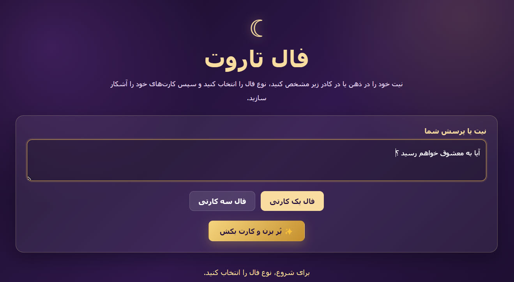
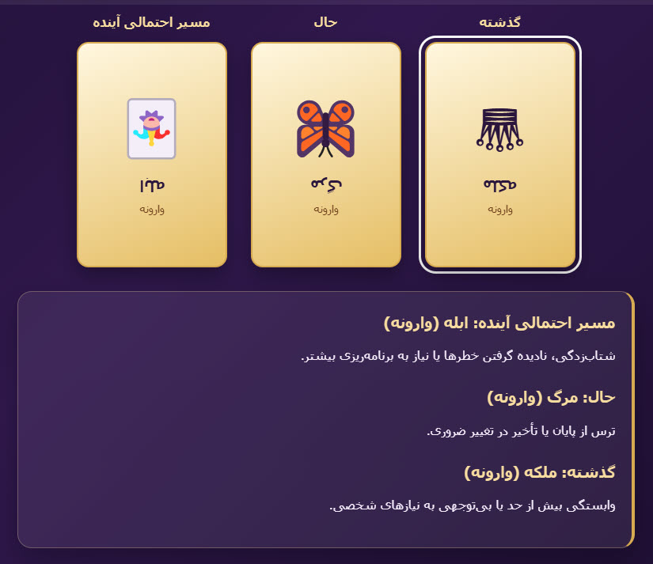

# Tarot Fortune - HTML5

<p align="center">
  A Persian Tarot reading website created with HTML5, CSS3, and Vanilla JavaScript.
</p>


---

## 📚 About This Project

This project was developed as a **classroom project** for learning and practicing the fundamentals of website design and front-end development.

The main objective was to understand how **HTML5**, **CSS3**, and **JavaScript** can work together to create an interactive, responsive, and visually appealing website.

The website provides a symbolic Persian Tarot reading experience for entertainment and personal reflection.

> [!NOTE]
> This project was created for educational purposes, classroom practice, entertainment, and personal reflection.

---

## ✨ Features

- 🌙 Persian right-to-left (RTL) user interface
- 🃏 One-card Tarot reading mode
- 🔮 Three-card Tarot reading mode
- ⏳ Past, Present, and Possible Future card positions
- 🎲 Random Tarot card selection
- ↕️ Upright and reversed card meanings
- 🔄 Interactive 3D card-flip animation
- ✍️ Intention or question input field
- 📱 Responsive design for desktop and mobile screens
- ⌨️ Keyboard-accessible card interactions
- 🚫 No backend required
- 🚫 No npm packages required
- 🚫 No external libraries required

---

## 🛠️ Technologies Used

| Technology | Purpose |
|---|---|
| HTML5 | Website structure and content |
| CSS3 | Styling, gradients, responsive layout, and animations |
| Vanilla JavaScript | Card selection, flip effects, and dynamic interpretations |

---

## 📁 Project Structure

```text
tarot-fortune-html5/
│
├── index.html
├── README.md
├── LICENSE
├── .gitignore
│
└── assets/
    ├── css/
    │   └── style.css
    │
    ├── js/
    │   └── script.js
    │
    └── screenshots/
        ├── s1.png
        └── s2.png
```

---

## 🖼️ Screenshots

### Main Page

<p align="center">
  
</p>

### Tarot Reading Example

<p align="center">
  
</p>

## 🚀 How to Run the Project

No installation is required.

1. Download or clone this repository.
2. Open the project folder.
3. Open the `index.html` file in a modern web browser.

### Recommended Browsers

- Google Chrome
- Microsoft Edge
- Mozilla Firefox
- Safari

---

## 🎴 How It Works

1. Enter an intention or question.
2. Select a reading type:
   - One-card reading
   - Three-card reading
3. Click the **Draw Card** button.
4. Tarot cards are selected randomly.
5. Click each card to reveal it.
6. Read the interpretation based on its orientation.

### Three-Card Reading Positions

| Position | Meaning |
|---|---|
| ⏮️ Past | Previous influences and background context |
| ⏺️ Present | Current energy, situation, or challenge |
| ⏭️ Possible Future | A possible direction based on the current situation |

---

## 🎓 Educational Value

This classroom project demonstrates the following front-end development concepts:

- Semantic HTML5 structure
- CSS variables
- CSS gradients
- Flexbox layout
- Responsive design with media queries
- Persian RTL layout
- JavaScript DOM manipulation
- Event listeners
- Random selection from arrays
- Dynamic HTML rendering
- CSS transitions
- CSS 3D transformations
- Interactive card-flip effects
- GitHub project organization

---

## 🔮 Future Improvements

Possible future improvements include:

- [ ] Add all 78 Tarot cards
- [ ] Add Minor Arcana cards
- [ ] Add custom Tarot card illustrations
- [ ] Add background music and sound effects
- [ ] Save reading history using `localStorage`
- [ ] Add a daily Tarot card feature
- [ ] Add multilingual support
- [ ] Add light and dark themes
- [ ] Add shareable reading results
- [ ] Deploy the project using GitHub Pages

---

## ⚠️ Disclaimer

> [!WARNING]
> Tarot readings are not scientifically proven methods for predicting the future.

This website is intended only for classroom learning, entertainment, and personal reflection. It should not be used as the basis for important medical, legal, financial, psychological, or personal decisions.

---

## 📄 License

This project is licensed under the [MIT License](LICENSE).
